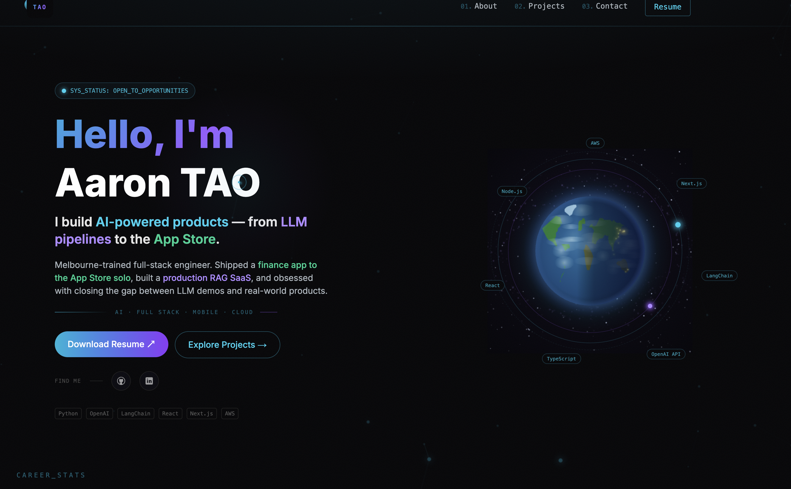

# 🖥️ Personal Portfolio Website

---

🌟##  Overview

**Personal Portfolio Website** is a modern, fully responsive portfolio built with Next.js, React, TailwindCSS, and TypeScript.  
It showcases your skills, projects, achievements, and contact information in a clean, professional layout with smooth animations and email integration.  
Perfect for developers, designers, and anyone looking to present their work online.

---

🌐 ## Live Demo

[www.aarontao.com](https://www.aarontao.com/)

  

---

##  Table of Contents

- [Overview](#overview)
- [Live Demo](#live-demo)
- [Features](#features)
- [Tech Stack](#tech-stack)
- [Key Sections](#key-sections)
- [Screenshots](#screenshots)
- [FAQ](#faq)
- [Contributing](#contributing)
- [License](#license)
- [Contact](#contact)
- [Acknowledgements](#acknowledgements)

---

📑##  Features

- 📱 **Fully Responsive Design** – Looks great on all devices.
- 🎨 **Modern UI with TailwindCSS** – Clean, customizable, and fast.
- ✨ **Smooth Animations with Framer Motion** – Engaging user experience.
- 📧 **Contact Form with Email Integration** – Direct messages to your inbox.
- 🌙 **Dark/Light Mode Support** – Comfortable viewing anytime.
- 📊 **Dynamic Project Filtering** – Showcase your work interactively.
- 📈 **Animated Achievement Numbers** – Highlight your milestones.
- 🔗 **Social Links** – Easy access to your online presence.

---

##  Tech Stack

- **Frontend Framework:** Next.js 14
- **Styling:** TailwindCSS 3
- **Animations:** Framer Motion
- **Type Checking:** TypeScript
- **Email Service:** Resend (or your preferred provider)
- **Deployment:** Vercel

---

##  Key Sections

- 🏠 Hero Section
- 📊 Achievement Section
- 👨‍💻 About Me (Skills, Education, Certifications)
- 🎯 Projects Showcase
- 📬 Contact Form
- 🔗 Social Links

---

 ## Screenshots

  
  <!-- Add more screenshots as needed -->

---

##  FAQ

**Q: How do I add new projects to the portfolio?**  
A: Modify the `data/projects.ts` file and add your projects following the existing format.

---

## Contributing

Contributions are welcome!  
To contribute:

1. Fork the repository.  
2. Create a feature branch (`git checkout -b feature/your-feature`).  
3. Commit your changes (`git commit -m 'Add your feature'`).  
4. Push to your branch (`git push origin feature/your-feature`).  
5. Open a Pull Request.

Please run `npm run lint` before submitting and follow the project’s coding style.

---

## License

This project is licensed under the MIT License.  
See the [LICENSE](LICENSE) file for details.

---

##  Contact

- **Name:** Aaron TAO  
- **Email:** [taoaaron5@gmail.com](mailto:taoaaron5@gmail.com)  
- **GitHub:** [HAONANTAO](https://github.com/HAONANTAO)  
- **Website:** [www.aarontao.com](https://www.aarontao.com/)

---

##  Acknowledgements

- [Next.js](https://nextjs.org/)
- [TailwindCSS](https://tailwindcss.com/)
- [Framer Motion](https://www.framer.com/motion/)
- [Resend](https://resend.com/)
- [Vercel](https://vercel.com/)
- All open source contributors and community

---

Thank you for visiting my portfolio! 🚀
